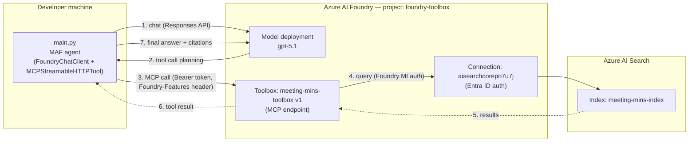

# foundry-toolbox

Isolated spike to evaluate **[Foundry Toolboxes][blog]** before deciding
whether to adopt them in `mtn-execu-copilot`.

A Toolbox is a Foundry-managed bundle of tools (AI Search, Bing, MCP servers,
OpenAPI, File Search, …) exposed via a **single MCP-compatible endpoint**.
Any agent runtime that speaks MCP can consume it — no per-tool SDK wiring,
no per-agent credential management.

[blog]: https://devblogs.microsoft.com/foundry/introducing-toolboxes-in-foundry/

---

## TL;DR

This spike proves the full loop works against our `foundry-toolbox` Foundry
project and the `meeting-mins-index` AI Search index:

1. `build_toolbox.py` registers an Azure AI Search tool inside a new toolbox
   version managed by Foundry, and prints the MCP endpoint.
2. `main.py` is a Microsoft Agent Framework (MAF) agent backed by
   `gpt-5.1`. It attaches the toolbox as a **single MCP tool** and
   automatically discovers + invokes the underlying tools.

End-to-end: grounded answers with citations, sub-second tool calls, zero
per-tool wiring in agent code.

---

## Architecture



**Key points**

- The agent talks to **one** Foundry endpoint for tools. Adding more tools to
  the toolbox later requires no agent-side change.
- Auth from agent → toolbox uses **Microsoft Entra** (DefaultAzureCredential)
  with scope `https://ai.azure.com/.default`.
- Auth from toolbox → AI Search uses the **Foundry resource's system-assigned
  managed identity**, granted `Search Index Data Reader` on the search
  service.

---

## Repository layout

```
foundry-toolbox/
├── build_toolbox.py     # creates / updates the toolbox version in Foundry
├── main.py              # MAF agent that consumes the toolbox via MCP
├── pyproject.toml       # uv project (prerelease=allow for agent-framework)
├── uv.lock
├── .env.example
├── .gitignore
└── README.md
```

---

## Prerequisites

| Requirement | Notes |
|---|---|
| `uv` | Python dependency manager. Install: <https://docs.astral.sh/uv/> |
| Python 3.12 | `uv` will provision this automatically |
| `az` CLI, logged in | `DefaultAzureCredential` picks up your `az login` session |
| Azure AI Foundry project | `foundry-toolbox` in `foundry-resource-eastus` |
| Model deployment | `gpt-5.1` deployed in the Foundry project |
| Azure AI Search connection | Inside the Foundry project, name `aisearchcorepo7u7j`, **Entra ID** auth, pointing at the `ai-search-core` search service |
| Search index | `meeting-mins-index` exists in `ai-search-core` |

### IAM (one role only)

The Foundry project's **system-assigned managed identity**
(`foundry-resource-eastus`) needs:

| Role | Scope | Why |
|---|---|---|
| `Search Index Data Reader` | Azure AI Search service `ai-search-core` | Toolbox queries the index using Foundry's MI, not the user's identity |

> ⚠️ If the search service's `Settings → Keys → API Access control` is set to
> "API keys", RBAC is ignored. Set it to **Role-based access control** or
> **Both**.

Your *user* identity needs the usual Foundry project access (`Azure AI User`
is enough) to create the toolbox via `build_toolbox.py`.

---

## Setup

```powershell
# In C:\Users\sarrabelly\Documents\GitHub\foundry-toolbox
uv sync
az login
Copy-Item .env.example .env
```

`.env` is pre-populated for the `foundry-toolbox` project — fill in
`FOUNDRY_TOOLBOX_ENDPOINT` after step 1 below.

### 1. Build the toolbox

```powershell
uv run python build_toolbox.py
```

Output ends with:

```
Created toolbox: meeting-mins-toolbox, version: 1
MCP endpoint:
  https://foundry-resource-eastus.services.ai.azure.com/api/projects/foundry-toolbox/toolboxes/meeting-mins-toolbox/versions/1/mcp?api-version=v1
```

Paste that URL into `.env` as `FOUNDRY_TOOLBOX_ENDPOINT`.

### 2. Run the agent

```powershell
uv run python main.py "what was decided about ESG and executive compensation?"
```

Sample output:

```
The board decided that ESG would be explicitly integrated into executive compensation:
- Key ESG metrics (carbon reductions, diversity, social impact) added to the executive scorecard.
- A portion of variable pay tied to sustainability goals alongside financial targets.
Source: Board Meeting – 15 September 2023, "ESG in Strategy & Compensation" section.
```

---

## Environment variables

| Var | Purpose |
|---|---|
| `FOUNDRY_PROJECT_ENDPOINT` | Foundry project endpoint — the toolbox lives here |
| `FOUNDRY_MODEL` | Chat model deployment (`gpt-5.1`) |
| `TOOLBOX_NAME` | Name of the toolbox to create / reuse |
| `FOUNDRY_TOOLBOX_ENDPOINT` | MCP endpoint printed by `build_toolbox.py` |
| `SEARCH_CONNECTION_NAME` | Foundry connection name (auto-generated by Foundry, e.g. `aisearchcorepo7u7j`) |
| `SEARCH_INDEX_NAME` | Index inside the search service (`meeting-mins-index`) |
| `AZURE_SEARCH_ENDPOINT` | Informational only; resolved via the connection |
| `AGENT_NAME` | Display name for the local agent |

---

## How the code works

### `build_toolbox.py`

1. Resolves the Foundry connection by name → gets the full ARM resource id.
2. Builds an `AzureAISearchTool` model with one `AISearchIndexResource`
   pointing at `meeting-mins-index`, query type `SIMPLE`, `top_k=5`.
3. Calls `client.beta.toolboxes.create_version(name=..., tools=[...])`.
4. Constructs the MCP endpoint URL from the project endpoint, toolbox name,
   and version (the SDK doesn't return it directly).

### `main.py`

1. Creates a `FoundryChatClient` (native Foundry client, Responses API,
   `gpt-5.1`).
2. Wraps an `httpx.AsyncClient` with a custom `httpx.Auth` that injects a
   fresh `Bearer` token on every request (scope:
   `https://ai.azure.com/.default`) and adds the
   `Foundry-Features: Toolboxes=V1Preview` header.
3. Creates an `MCPStreamableHTTPTool` pointed at the toolbox URL,
   reusing that http client.
4. `as_agent(tools=[mcp_tool])` exposes the entire toolbox to the agent as
   one tool — the agent then dynamically discovers the underlying tools via
   MCP and calls them.
5. `await agent.run(question)` returns the grounded answer.

---

## Gotchas (learned the hard way)

| Issue | Resolution |
|---|---|
| Blog uses `client.beta.toolboxes.create_toolbox_version(toolbox_name=...)` | Real SDK is `client.beta.toolboxes.create_version(name=...)` |
| Blog uses MCP path `/toolbox/...` (singular) | Real path is `/toolboxes/...` (plural) |
| Token scope easy to get wrong | Must be `https://ai.azure.com/.default` |
| `AzureOpenAIChatClient` from blog example doesn't exist in `agent-framework` 1.7 | Use `FoundryChatClient` from `agent_framework.foundry` |
| Connection name auto-suffixed by Foundry portal | Use whatever Foundry generated (e.g. `aisearchcorepo7u7j`), not your desired name |
| AI Search 403 from toolbox | Grant Foundry MI `Search Index Data Reader` on the search service |
| Noisy `cancel scope in a different task` traceback on shutdown | Enter `MCPStreamableHTTPTool` as `async with mcp_tool:` in the same task as the httpx client (already fixed in `main.py`) |

---

## Versioning a toolbox

Toolboxes have built-in versioning. Workflow:

```python
# Iterate without affecting consumers — they keep pointing at the default version
client.beta.toolboxes.create_version(name="meeting-mins-toolbox", tools=[...])

# When the new version is validated, promote it
client.beta.toolboxes.update(name="meeting-mins-toolbox", default_version="2")
```

Consumers using the **version-less** URL transparently get the new version:

```
…/toolboxes/meeting-mins-toolbox/mcp?api-version=v1
```

---

## Why this matters for `mtn-execu-copilot`

| Today (per-tool wiring) | With a toolbox |
|---|---|
| Each agent imports an AI Search SDK, a Bing SDK, an MCP client, … | Each agent attaches one `MCPStreamableHTTPTool` |
| Each agent manages auth per tool | One Entra token for the toolbox endpoint |
| Adding a tool requires a code change + redeploy in every agent | Add to toolbox → bump version → promote default → consumers unchanged |
| Tool inventory scattered across repos | Centralized in Foundry portal |
| Governance applied per agent (or not at all) | Centralized at the toolbox boundary (preview today, GA later) |
| Locked into one agent runtime | Same toolbox works from MAF, LangGraph, Copilot SDK, GitHub Copilot, Claude Code, any MCP client |

**Risks / open questions for porting**

- **Preview status.** `client.beta.toolboxes.*` and `Foundry-Features=Toolboxes=V1Preview` are public preview. Production adoption should wait for GA, or be feature-flagged.
- **Latency.** MCP adds one hop per tool call (agent → toolbox → underlying tool). For latency-sensitive flows in mtn-execu-copilot we should benchmark this.
- **Observability.** The "Govern" pillar (centralized auth + telemetry) is not yet in preview. Until then, observability still has to be wired per agent.
- **Tool catalogue parity.** Verify every tool mtn-execu-copilot uses today is on the toolbox-supported list (built-in tools, MCP, A2A, OpenAPI).

---

## Cleanup

```powershell
# List versions
uv run python -c "from azure.ai.projects import AIProjectClient; from azure.identity import DefaultAzureCredential; import os; from dotenv import load_dotenv; load_dotenv(); c = AIProjectClient(endpoint=os.environ['FOUNDRY_PROJECT_ENDPOINT'], credential=DefaultAzureCredential()); [print(v.name, v.version) for v in c.beta.toolboxes.list_versions(name='meeting-mins-toolbox')]"

# Delete the toolbox entirely
uv run python -c "from azure.ai.projects import AIProjectClient; from azure.identity import DefaultAzureCredential; import os; from dotenv import load_dotenv; load_dotenv(); c = AIProjectClient(endpoint=os.environ['FOUNDRY_PROJECT_ENDPOINT'], credential=DefaultAzureCredential()); c.beta.toolboxes.delete(name='meeting-mins-toolbox'); print('deleted')"
```

---

## References

- Announcement blog: <https://devblogs.microsoft.com/foundry/introducing-toolboxes-in-foundry/>
- Foundry Toolbox docs: <https://learn.microsoft.com/en-us/azure/foundry/agents/how-to/tools/toolbox>
- Microsoft Agent Framework: <https://github.com/microsoft/agent-framework>
- `azure-ai-projects` SDK: <https://pypi.org/project/azure-ai-projects/>
